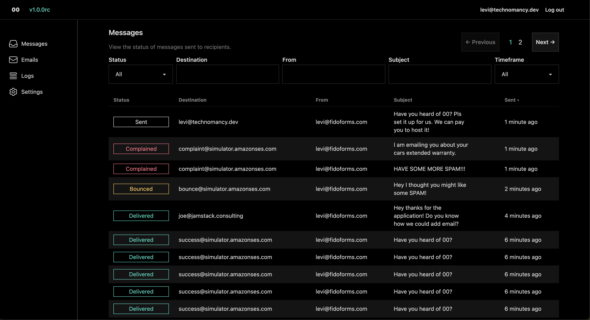

# 00 is a self hostable SES dashboard for sending and monitoring emails with AWS.

SES is an incredibly affordable way to build an email heavy application.

However monitoring the emails is a bit of a nightmare, and often requires custom infrastructure. Even setting up the SES -> SNS -> SQS pipeline is a headache for developers unfamiliar with AWS. And when that is done your still left with hooking in or building custom some dashboard for viewing bounces and all the vital information you care about.

00 provides an SST configuration step to set up the SES -> SNS -> SQS pipeline,
so you can just run a command and let SST do the rest.

Then 00 provides you that dashboard for viewing the information you care about.



Some key features include:

- Run SST to configure AWS for you.
- The ability to send emails by sending a `POST` request to `/api/emails`.
- Monitor email status (with multi-recipient tracking).
- Search emails and messages (a message is created for every recipient).
- View email body.
- Log tracking for requests and queue.

## Getting started

The quickest way to get started is to clone this repo and run `sst deploy` in it. Make sure to set the `EMAIL_IDENTITY` env variable first, this will be the email or domain you wish to send from.

Using SST is easy, and you can find the steps to do so [here](https://ion.sst.dev/docs/reference/cli) and learn how to configure your credentials [here](https://docs.sst.dev/advanced/iam-credentials#loading-from-a-file)

If you would like to avoid using SST you must manually configure AWS.
You need to set up a configuration set to write to an SQS queue via SNS. You can configure it however you want, but the more events you send to the queue the more 00 will be able to track (obviously).

Either option will give you an SQS url which we need, along with several other environment variables.

We publish a docker image to the [registery](https://hub.docker.com/r/liltechnomancer/double-zero)

Simply run `docker pull liltechnomancer/double-zero`

Then run your docker container with the following environment variables set. Exposing port 4000.

Example `docker run -it --env-file ./env -p 80:4000 "liltechnomancer/double-zero"`

```
AWS_SECRET_ACCESS_KEY=
AWS_ACCESS_KEY_ID=
AWS_REGION= # Ex: us-east-1
SQS_URL=  # Ex: https://sqs.us-east-1.amazonaws.com/${id}

SYSTEM_EMAIL= # For sending stuff like password resets. Ex: test@example.com should be able to send from SES.

SECRET_KEY_BASE= # A long secret. at least 64 characters. Can be made with mix phx.gen.secret or however you generate safe keys.

DATABASE_PATH= # Path to SQLite database Ex: 00.db
PHX_HOST= #  URL or IP of where this service is running. Ex: example.com
```

Now visit your url (whatever you set PHX_HOST to) and register your user.
After registering click on settings to create an API key.
Keep this key as you wont be able to see it again and treat it like a password.

Now you can make API requests to send email to `yourdomain.com/api/emails`.

Here is an example.

```json
{
  "markdown": "# Language Syntax Highlight Demo\n\n## Erlang\n\n```erlang\n-module(tut14).\n\n-export([start/0, say_something/2]).\n\nsay_something(What, 0) ->\n    done;\nsay_something(What, Times) ->\n    io:format('~p~n', [What]),\n    say_something(What, Times - 1).\n\nstart() ->\n    spawn(tut14, say_something, [hello, 3]),\n    spawn(tut14, say_something, [goodbye, 3]).\n```",
  "subject": "Can your email service track multiple recipients?",
  "from": "levi@fidoforms.com",
  "to": ["levi@technomancy.dev", "complaint@simulator.amazonses.com"]
}
```

Or replace markdown with html

```json
{
  "html": "<h1>Hello world!</h1>",
  "subject": "Can your email service track multiple recipients?",
  "from": "levi@fidoforms.com",
  "to": ["levi@technomancy.dev", "complaint@simulator.amazonses.com"]
}
```

Add attachments or provider options.

```json
{
  "markdown": "# Hey",
  "subject": "Hark, who goes there?",
  "from": "levi@jamstack.consulting",
  "to": "levi@technomancy.dev",
  "headers": {
     "X-Entity-Ref-ID": "00"
   },
  "provider_options": {
    "tags": [{
      "name": "tag-name",
      "value": "some-value"
    }]
  },
  "attachments": [
    {
      "filename": "invoice.txt",
      "content": "pewp"
    }
  ]
}
```

Stuck? Tell me about it on [Discord](https://discord.gg/6r7Qtf754K) and lets unstick you!

## Pro + support open source.

If you are eager to support this project you can pre-order a [pro version](https://buy.stripe.com/5kA3dV5W1aBgaUo28e?prefilled_promo_code=EARLYBIRD) for you to self host.

Planned pro features include

* Multiple Users
* Teams
* Advanced Analytics
* Track email history
* Possibly more, we will see.

## This is a Phoenix app! To work on it start with:

To start your Phoenix server:

  * Run `mix setup` to install and setup dependencies
  * Start Phoenix endpoint with `mix phx.server` or inside IEx with `iex -S mix phx.server`

Now you can visit [`localhost:4000`](http://localhost:4000) from your browser.

Ready to run in production? Please [check our deployment guides](https://hexdocs.pm/phoenix/deployment.html).

## Learn more

  * Official website: https://www.phoenixframework.org/
  * Guides: https://hexdocs.pm/phoenix/overview.html
  * Docs: https://hexdocs.pm/phoenix
  * Forum: https://elixirforum.com/c/phoenix-forum
  * Source: https://github.com/phoenixframework/phoenix
